# Tournaments Project Hosting Setup on Hostinger

## Prerequisites

Before you begin, ensure you have the following:
- A Hostinger account
- Domain configured
- SSH credentials
- Vim knowledge (If you don't know Vim, watch the following video: https://youtu.be/9cC9x-ntNQY?si=phVs66Fv8NdwzIdn)

## Step 1: Navigate to VPS Panel

1. Log in to your Hostinger account.
2. Navigate to the **VPS** section and click **Manage** 
 
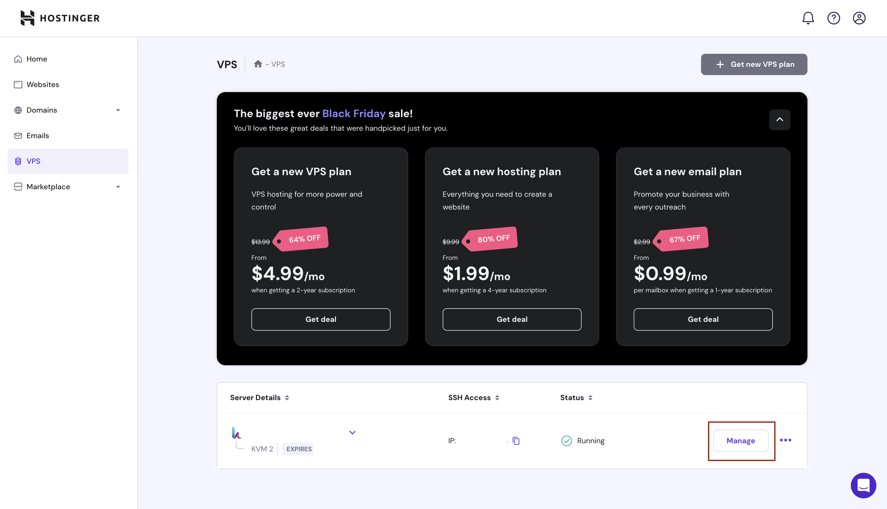

3. Now you are under **Hostinger VPS panel!**
 
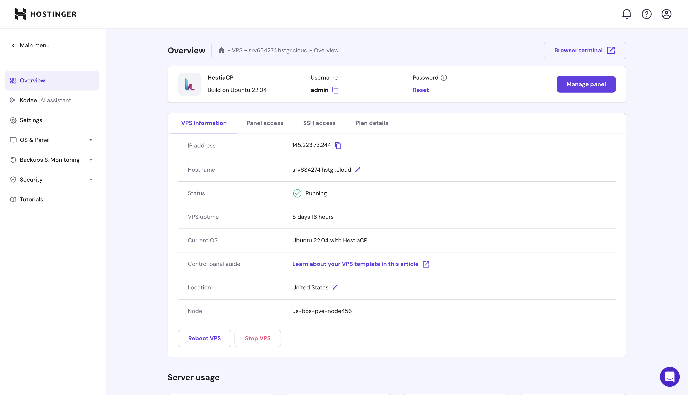

## Step 2: Create Database

1. Click **Manage Panel**
 
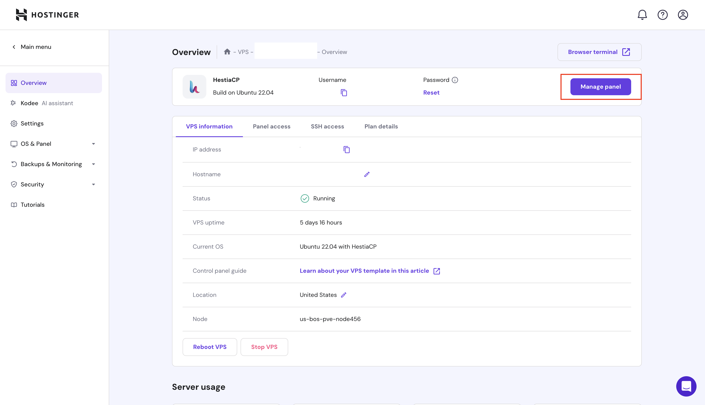
2. Now you are in Hestia's control Panel, in order to create a **new Database** you will need to create a **user**, click **Add User**
 
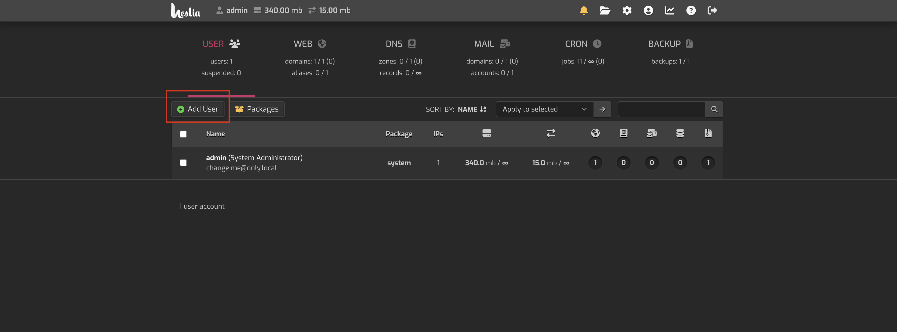

3. Now **fill out** form and click **save**
 
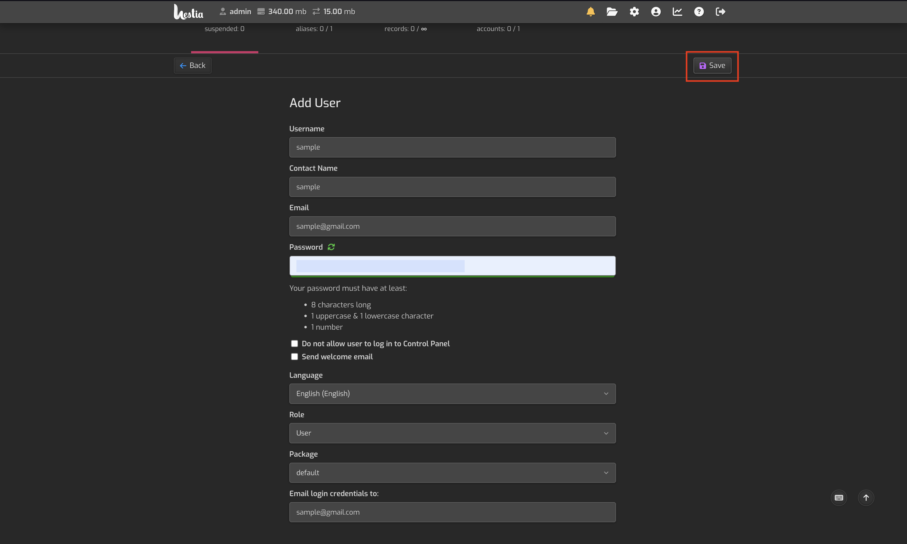

4. Navigate back to the **Users tab** and click on the **Login Icon**
 
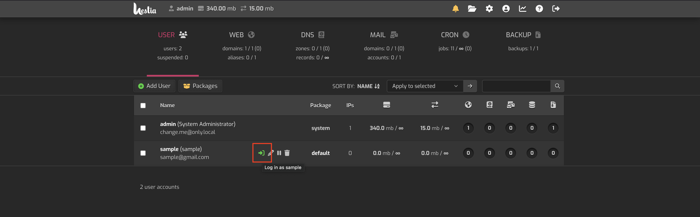

5. Now, Navigate to the **DB tab**
 
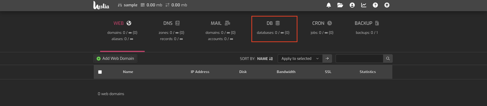

6. Click **Add Database**
 
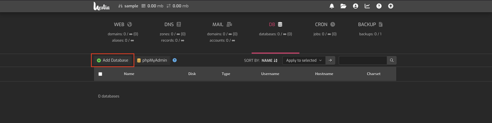

7. Now **fill out** form, remember your **Database's credentials** and click **save**
 

## Step 3: Connect to Hestia panel SSH via
SSH (Secure Shell) is a protocol used to securely connect to a remote computer or server over a network. It provides encrypted communication for tasks such as command-line access, file transfers, and remote administration.

1. If you are **NOT** on **Windows** you can **skip** this step. If you are on **Windows** bruh... you are not cooking,
Follow this:
[Tutorial to setup SSH for windows terminal](https://youtu.be/3hbJZZ4c1io?si=QaRciN6AZXDJHc6a)

2. Go back to your **Hostinger VPS panel**
3. Click **SSH access**
 
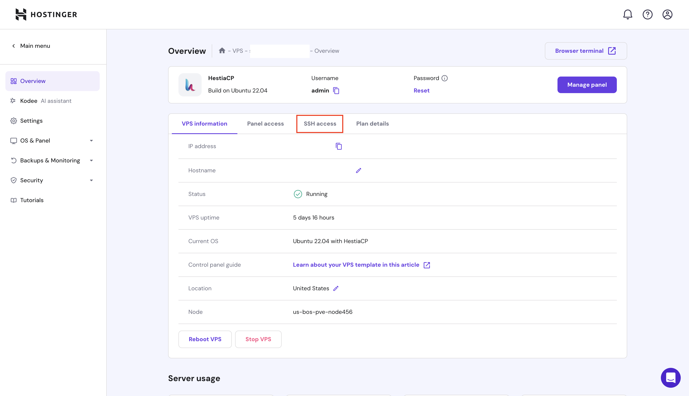

4. Copy the **SSH terminal credentials**
 
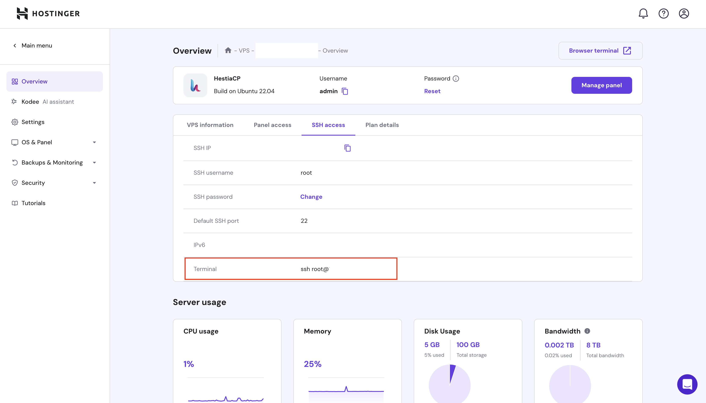

5. Open a **terminal** and paste **SSH credentials**
 
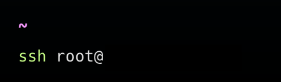

6. Input your **password**
 
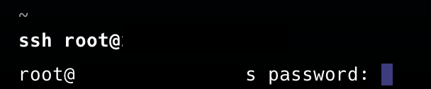

## Step 4: Project setup

1. Install php: `sudo apt install php8.1 php8.1-cli php8.1-fpm php8.1-mbstring php8.1-xml php8.1-curl php8.1-zip -y` you can **verify** installation by running `php -v`

2. Download Composer installer `curl -sS https://getcomposer.org/installer -o composer-setup.php`

3. Run Composer installer `sudo php composer-setup.php --install-dir=/usr/local/bin --filename=composer`

4. Remove the installer `rm composer-setup.php` you can also **verify** installation by running `composer -v`

5. Navigate to your **public_html domain folder** `cd /home/youruser/web/yourdomain/public_html/`

6. Run: `git clone https://github.com/StarEngineer89/ci_tournament_bracket-generator` **Output**: 
 
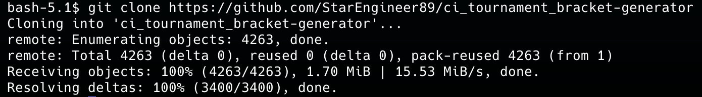

7. Navigate to your project `cd project`

8. Run `composer update` you will be ask to `Continue as root/super user [yes]? ` type yes.
Output: 
 
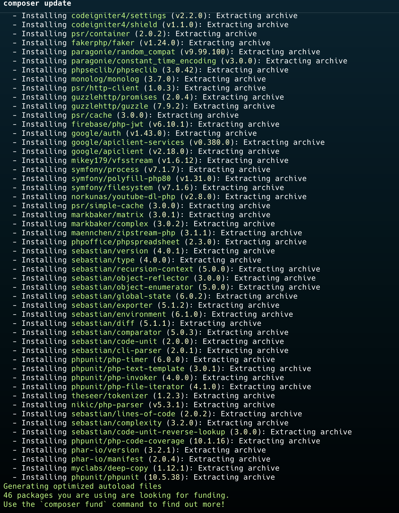

9. Rename env to .env `mv env .evn`

10. Open .env with vim `vim .env`

11. Edit your baseURL to `'https://yourdomain/'`
 
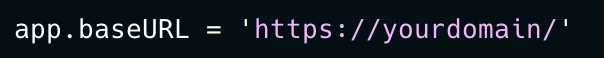

12. Edit your database credentials, use the credentials you created in **First Step**
 
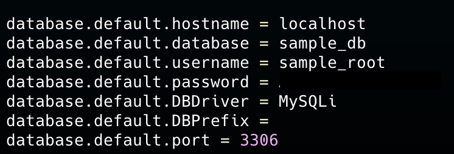

13. Save and exit **vim** editor

14. To migrate project database run `php spark shield:setup` you will be asked to overwrite type `n` when asked, then you will be ask to `Run `spark migrate --all` now?` type `y`
 
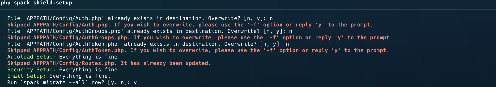
 
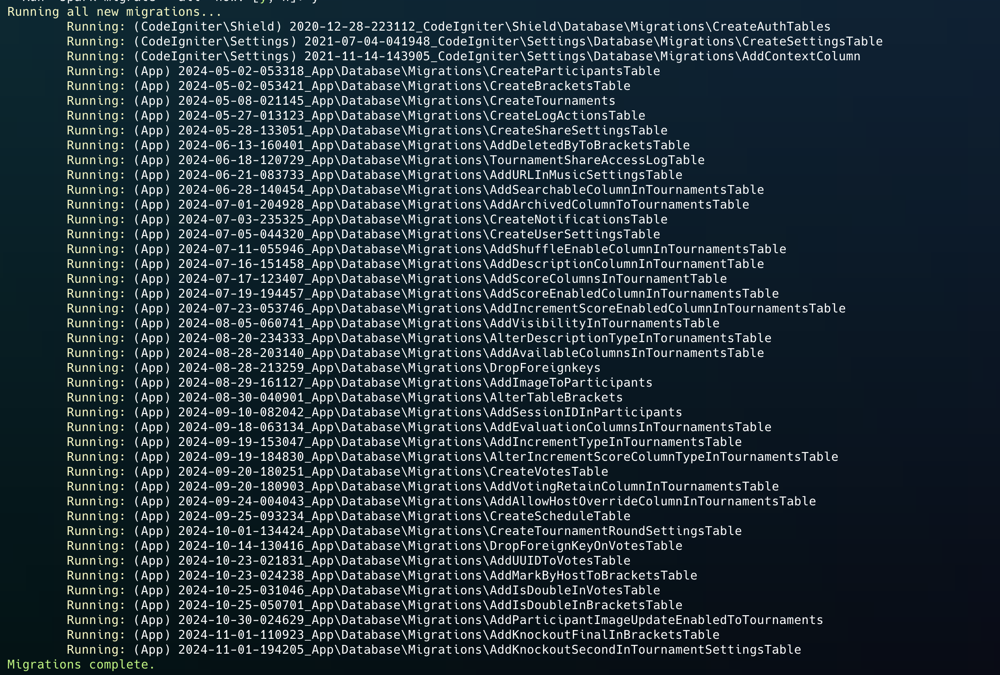

15. Now move **public folder to public_html** `mv public ..`

16. Navigate to **public_html** `cd ..`

17. Run `mv public/{.,}* .` this command moves recursively all public content to public's parent (public_html) then run la to verify everything moved as expected.
 
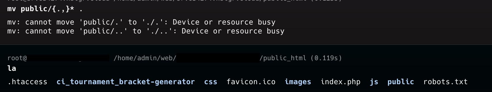

18. Delete public folder `rm -rf public`

19. Now, open index.php with vim `vim index.php` and edit FCPATH to `'./ci_tournament_bracket-generator/app/Config/Paths.php'`
 
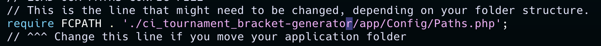

20. Save and exit **vim** editor

-Now we need to give some permissions to writable folder. 

21. Navigate to writable `cd /project/writable`

22. Give permissions to the whole writable folder `sudo chmod -R 777 .`

-Now we will link writable/uploads to public_html/uploads

23. Navigate to uploads `cd uploads`, run `pwd` and save that path.

24. Navigate to public_html `cd ../../..`

25. Now link upload directory `ln -s /path/to/your/codeigniter/writable/uploads /path/to/your/public_html/`

-Finally, the only missing thing is setting up cronjob

26. Navigate to your project `cd project/`

27. Run `pwd` and save project's full path

26. Go back to **Hestia control panel** and click **CRON**
 
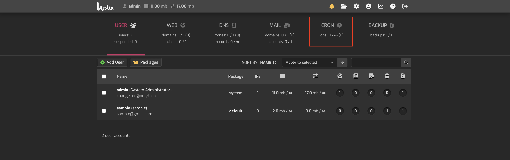

27. Click **Add Cron Job**
 
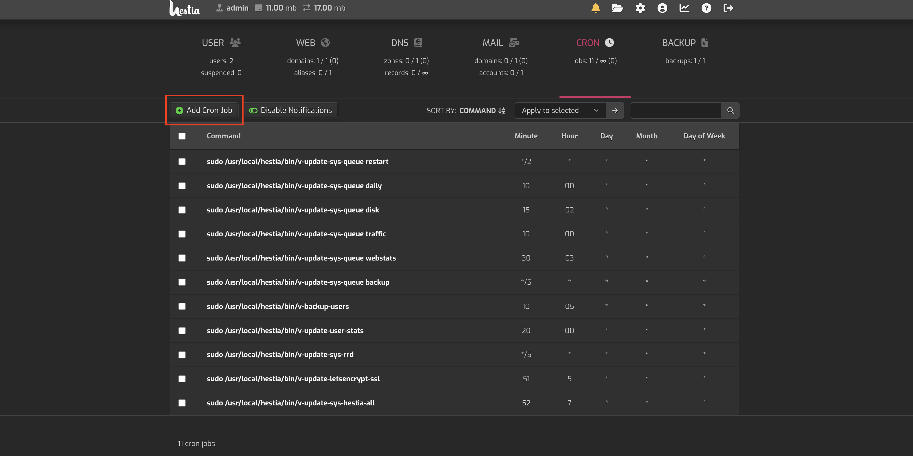

28. Under comman section write down the following command: /usr/bin/php /path/to/your/project/spark task:run
 

29. By default, it is set to every minute, which is what we need. You can just click **generate**
 
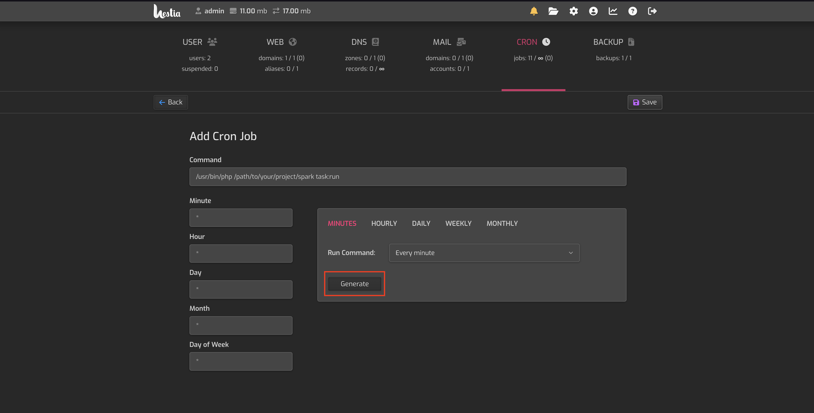

30. Click **save**
 
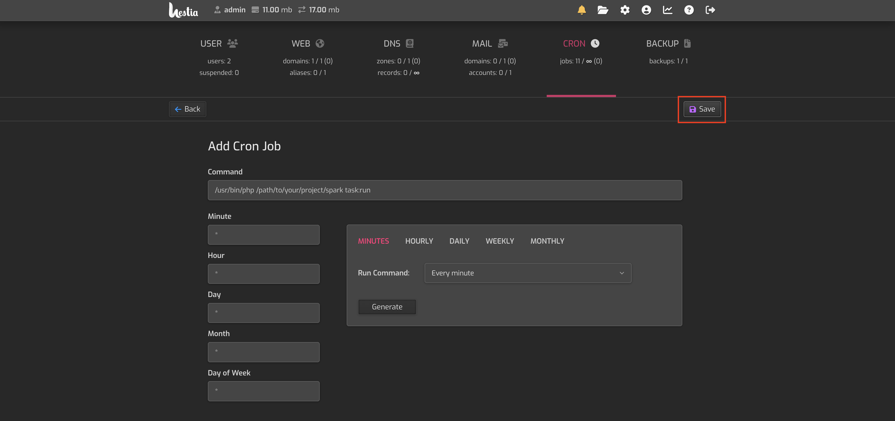

## Congrats! you have successfully set up the project.