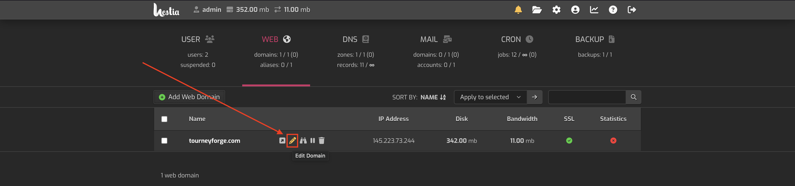
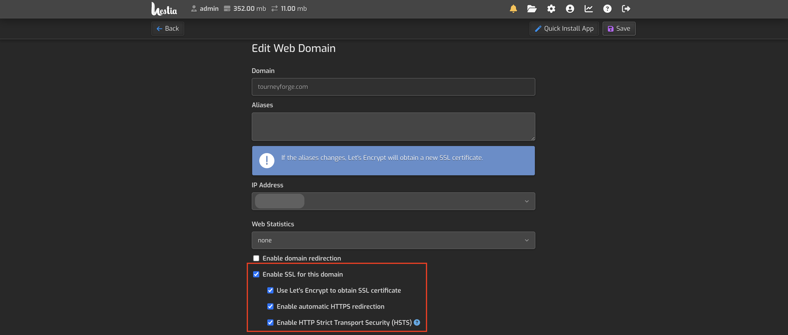

# Tournaments Project Hosting Setup on Hostinger

## Prerequisites

Before you begin, ensure you have the following:
- A Hostinger account
- Domain configured
- SSH credentials
- Vim knowledge (If you don't know Vim, watch the following video: https://youtu.be/9cC9x-ntNQY?si=phVs66Fv8NdwzIdn)

## Step 1: Navigate to VPS Panel

1. Log in to your Hostinger account.
2. Navigate to the **VPS** section and click **Manage** 
<br>


3. Now you are under **Hostinger VPS panel!**
<br>


## Step 2: Create Database

1. Click **Manage Panel**
<br>

2. Now you are in Hestia's control Panel, in order to create a **new Database** you will need to create a **user**, click **Add User**
<br>


3. Now **fill out** form and click **save**
<br>


4. Navigate back to the **Users tab** and click on the **Login Icon**
<br>


5. Now, Navigate to the **DB tab**
<br>


6. Click **Add Database**
<br>


7. Now **fill out** form, remember your **Database's credentials** and click **save**
<br>


## Step 3: Connect to Hestia panel SSH via
SSH (Secure Shell) is a protocol used to securely connect to a remote computer or server over a network. It provides encrypted communication for tasks such as command-line access, file transfers, and remote administration.

1. If you are **NOT** on **Windows** you can **skip** this step. If you are on **Windows** bruh... you are not cooking,
Follow this:
[Tutorial to setup SSH for windows terminal](https://youtu.be/3hbJZZ4c1io?si=QaRciN6AZXDJHc6a)

2. Go back to your **Hostinger VPS panel**
3. Click **SSH access**
<br>


4. Copy the **SSH terminal credentials**
<br>


5. Open a **terminal** and paste **SSH credentials**
<br>


6. Input your **password**
<br>


## Step 4: Project setup

1. Install php: `sudo apt install php8.1 php8.1-cli php8.1-fpm php8.1-mbstring php8.1-xml php8.1-curl php8.1-zip -y` you can **verify** installation by running `php -v`

2. Download Composer installer `curl -sS https://getcomposer.org/installer -o composer-setup.php`

3. Run Composer installer `sudo php composer-setup.php --install-dir=/usr/local/bin --filename=composer`

4. Remove the installer `rm composer-setup.php` you can also **verify** installation by running `composer -v`

5. Navigate to your **public_html domain folder** `cd /home/youruser/web/yourdomain/public_html/`

6. Run: `git clone https://github.com/StarEngineer89/ci_tournament_bracket-generator` **Output**: 
<br>


7. Navigate to your project `cd project`

8. Run `composer update` you will be ask to `Continue as root/super user [yes]? ` type yes.
Output: 
<br>


9. Rename env to .env `mv env .env`

10. Open .env with vim `vim .env`

11. Edit your baseURL to `'https://yourdomain/'`
<br>


12. Edit your database credentials, use the credentials you created in **First Step**
<br>


13. Save and exit **vim** editor

14. To migrate project database run `php spark shield:setup` you will be asked to overwrite type `n` when asked, then you will be ask to `Run spark migrate --all now?` type `y`
<br>

<br>


15. Now move **public folder to public_html** `mv public ..`

16. Navigate to **public_html** `cd ..`

17. Run `mv public/{.,}* .` this command moves recursively all public content to public's parent (public_html) then run la to verify everything moved as expected.
<br>


18. Delete public folder `rm -rf public`

19. Now, open index.php with vim `vim index.php` and edit FCPATH to `'./ci_tournament_bracket-generator/app/Config/Paths.php'`
<br>


20. Save and exit **vim** editor

-Now we need to give some permissions to writable folder. 

21. Navigate to writable `cd /project/writable`

22. Give permissions to the whole writable folder `sudo chmod -R 777 .`

-Now we will link writable/uploads to public_html/uploads

23. Navigate to uploads `cd uploads`, run `pwd` and save that path.

24. Navigate to public_html `cd ../../..`

25. Now link upload directory `ln -s /path/to/your/codeigniter/writable/uploads /path/to/your/public_html/`

-Finally, the only missing thing is setting up cronjob

26. Navigate to your project `cd project/`

27. Run `pwd` and save project's full path

26. Go back to **Hestia control panel** and click **CRON**
<br>


27. Click **Add Cron Job**
<br>


28. Under comman section write down the following command: /usr/bin/php /path/to/your/project/spark task:run
<br>


29. By default, it is set to every minute, which is what we need. You can just click **generate**
<br>


30. Click **save**
<br>


## Step 5: WebSocket setup

 You will need to setup SSL certificates, by default **HestiaCP** provides a *Let's Encrypt to obtain SSL certificate* option, this SSL certificate is already **Authenticated** this will help us to make our domain secure.

 1. Go back to **HestiaCP** and under *WEB* click **edit** domain
<br>


2. Enable all 4 options shown below.
<br>


3. Click "Save"
<br>


1. Now **Go back** to SSH Terminal and you will need to copy the path of your SSL certificates (They are set by default). You can find them under: `/usr/local/hestia/data/users/admin/ssl/domainname.com.crt` and `/usr/local/hestia/data/users/admin/ssl/domainname.com.key`

2. Navigate under the project directory and run `vim ws.php`

3. Edit the ws.php as shown below. Don't forget to change the certificates paths

```<?php

use Ratchet\MessageComponentInterface;
use Ratchet\ConnectionInterface;
use Ratchet\Server\IoServer;
use Ratchet\Http\HttpServer;
use Ratchet\WebSocket\WsServer;
use React\Socket\Server as ReactServer;
use React\Socket\SecureServer;

require __DIR__ . '/vendor/autoload.php';

class WebSocketsServer implements MessageComponentInterface {
    protected $clients;
    public function __construct() {
        $this->clients = new \SplObjectStorage;
    }
    public function onOpen(ConnectionInterface $conn) {
        $this->clients->attach($conn);
        echo "New connection! ({$conn->resourceId})\n";
    }
    public function onMessage(ConnectionInterface $from, $msg) {
        foreach ($this->clients as $client) {
            if ($from !== $client) {
                $client->send($msg);
            }
        }
    }
    public function onClose(ConnectionInterface $conn) {
        $this->clients->detach($conn);
        echo "Connection {$conn->resourceId} has disconnected\n";
    }
    public function onError(ConnectionInterface $conn, \Exception $e) {
        echo "An error has occurred: {$e->getMessage()}\n";
        $conn->close();
    }
}

$cert = '/usr/local/hestia/data/users/admin/ssl/yourDomainName.com.crt';
$key = '/usr/local/hestia/data/users/admin/ssl/yourDomainName.com.key';

$loop = React\EventLoop\Factory::create();
$socket = new ReactServer('0.0.0.0:8092', $loop);

$secureSocket = new SecureServer($socket, $loop, [
    'local_cert' => $cert,
    'local_pk' => $key,
    'allow_self_signed' => true,  //Set to false in production
    'verify_peer' => false,       //Set to true in production
]);

$wsServer = new HttpServer(
    new WsServer(
        new WebSocketsServer()
    )
);

$server = new Ratchet\Server\IoServer($wsServer, $secureSocket, $loop);
echo "Secure WebSocket server running on wss://localhost:8092\n";
$address = $secureSocket->getAddress();
echo "$address";
$server->run();
```

4. The script above, runs a websocket under the 8092 port by default the hosting already has some ports that receive TCP Requests, however, if we want to add custom ports we will need to configure the firewall with the following command. First we will need to go to our **iptables file** which is under the **etc** directory just run the following command: `cd /etc` then open the `iptables.rules` by running `vim iptables.rules`
You will find a file like this: 
```# Generated by iptables-save v1.8.7 on Mon Nov  4 06:45:34 2024
*filter
:INPUT DROP [0:0]
:FORWARD ACCEPT [0:0]
:OUTPUT ACCEPT [0:0]
:fail2ban-HESTIA - [0:0]
:fail2ban-MAIL - [0:0]
:fail2ban-RECIDIVE - [0:0]
:fail2ban-SSH - [0:0]
:fail2ban-WEB - [0:0]
:hestia - [0:0]
-A INPUT -p tcp -m multiport --dports 80,443 -j fail2ban-WEB
-A INPUT -p tcp -m tcp --dport 8083 -j fail2ban-HESTIA
-A INPUT -p tcp -m multiport --dports 25,465,587,110,995,143,993 -j fail2ban-MAIL
-A INPUT -p tcp -m tcp --dport 22 -j fail2ban-SSH
-A INPUT -p tcp -m multiport --dports 1:65535 -j fail2ban-RECIDIVE
-A INPUT -m state --state RELATED,ESTABLISHED -j ACCEPT
-A INPUT -s 145.223.73.244/32 -j ACCEPT
-A INPUT -s 127.0.0.1/32 -j ACCEPT
-A INPUT -p tcp -m tcp --dport 22 -j ACCEPT
-A INPUT -p tcp -m multiport --dports 80,443 -j ACCEPT
-A INPUT -p tcp -m multiport --dports 21,12000:12100 -j ACCEPT
-A INPUT -p udp -m udp --dport 53 -j ACCEPT
-A INPUT -p tcp -m tcp --dport 53 -j ACCEPT
-A INPUT -p tcp -m multiport --dports 25,465,587 -j ACCEPT
-A INPUT -p tcp -m multiport --dports 110,995 -j ACCEPT
-A INPUT -p tcp -m multiport --dports 143,993 -j ACCEPT
-A INPUT -p tcp -m tcp --dport 8083 -j ACCEPT
-A INPUT -p tcp -m tcp --dport 8092 -j ACCEPT
-A INPUT -p icmp -j ACCEPT
-A fail2ban-HESTIA -j RETURN
-A fail2ban-MAIL -j RETURN
-A fail2ban-RECIDIVE -j RETURN
-A fail2ban-SSH -j RETURN
-A fail2ban-WEB -j RETURN
COMMIT
# Completed on Mon Nov  4 06:45:34 2024
```

5. Now you will add at the end of the tcp rules the following rule: `-A INPUT -p tcp -m tcp --dport 8092 -j ACCEPT`, exit and save the file.

6. You will need to restart the firewall configuration by running the following command `sudo iptables-restore < /etc/iptables.rules`

7. Now you will need to run the ws.php using **tmux**, in order to do that, we will need to install tmux, run `apt install tmux`.

8. Now initialize **tmux** run: `tmux`, now this will create a new instance of a virtual terminal.

9. Make sure you are under the correct directory (wherever ws.php is located). Run:  `php ws.php run`

10. Now we have to detach our terminal to the virtual instance (the websocket will continue running). In order to do that you will need to press: `Ctrl-b + d`

## The steps above are meant for running the websocket manually, but whenever the server gets rebooted you will need to manually run it again. Follow the next section to make websocket automatically run on reboot.

## Step 6: WebSocket automatization (run on reboot)

### In this section we will use resources like `systemd` in order to make the Operating System to always run some scripts to make websocket run.
#### It is important to mention what the main script does: It kills ALL processes running on port 8092, usually there shouulnd't be any, but once a port is opened and allowed in our firewall, the Operating System will always try to occupy it. After it kills all processes, it runs the websocket (which we configured before) and sets up the responsible user as root.

1. Theoretically we should need to setup the *iptables.rules* file but since we did it in the sixth step from last section we should be okay (if you haven't, just follow the 4, 5 and 6 steps from last section).

2. Now, we will need to create a *.service* file under the **system** direcrotry, in order to do that run: `cd /etc/systemd/system && vim ws-server.service` this command will navigate to the **system** directory and create (or overwrite) a file named **ws-server.service**. 

3. Copy and paste the following code:

```
[Unit]
Description=WebSocket Server for TourneyForge
After=network.target

[Service]
Type=simple
ExecStartPre=/bin/bash -c 'fuser -k 8092/tcp || true'
ExecStart=php /home/admin/web/tourneyforge.com/public_html/ci_tournament_bracket-generator/ws.php run
Restart=always
User=root
WorkingDirectory=/home/admin/web/tourneyforge.com/public_html/ci_tournament_bracket-generator

[Install]
WantedBy=multi-user.target
```

4. Now, since the source configuration file or drop-ins of **ws-server.service** changed on disk, we will need to reload units by runnning the following command: `systemctl daemon-reload`.

5. Then, we will need to restart the service we just created so we will run `systemctl restart ws-server`.

6. Now you are done, the websocket will always be running even if you reboot, it should be a good practice to reboot now just to verify if everything is working as expected. Run `reboot` (it can take up to 10 minutes).

## Congrats! you have successfully set up the project.