# Tournaments Project Hosting Setup on Hostinger

## Prerequisites

Before you begin, ensure you have the following:
- A Hostinger account
- Domain name configured
- SSH password (credentials)

## Step 1: Upload Project Files SSH VIA

1. Log in to your Hostinger account.
2. Navigate to the **Hosting** section and click **Manage** 
 
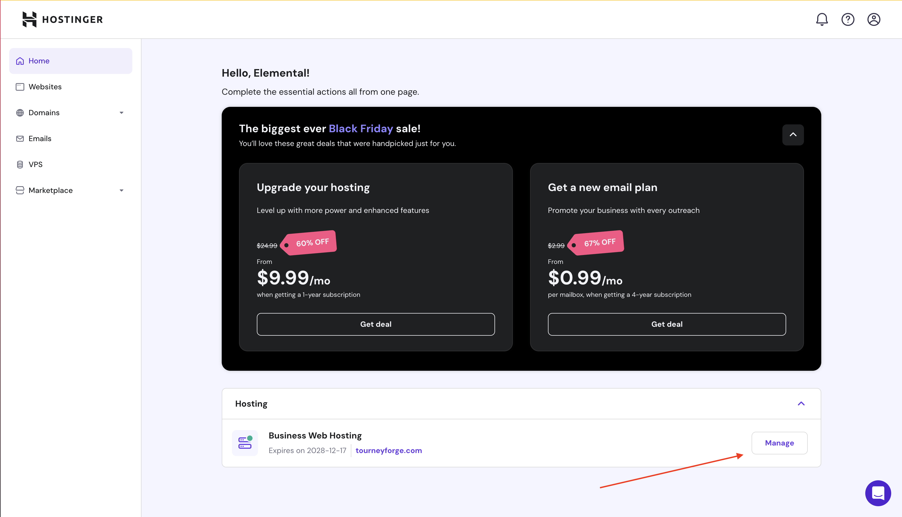
3. On the left menu, click **Advanced**
 
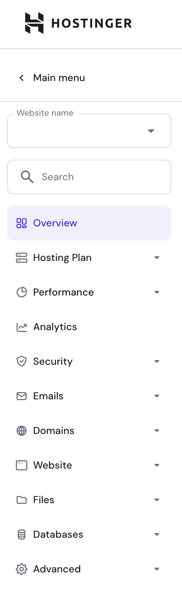
4. Click **SSH Acess**
 
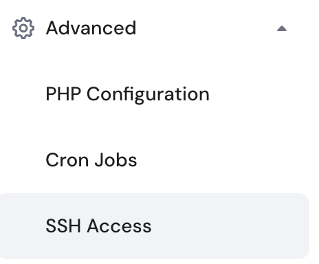
-SSH (Secure Shell) is a protocol used to securely connect to a remote computer or server over a network. It provides encrypted communication for tasks such as command-line access, file transfers, and remote administration.

5. Under **SSH Status** click **Enable** and wait a moment until it turns on
 
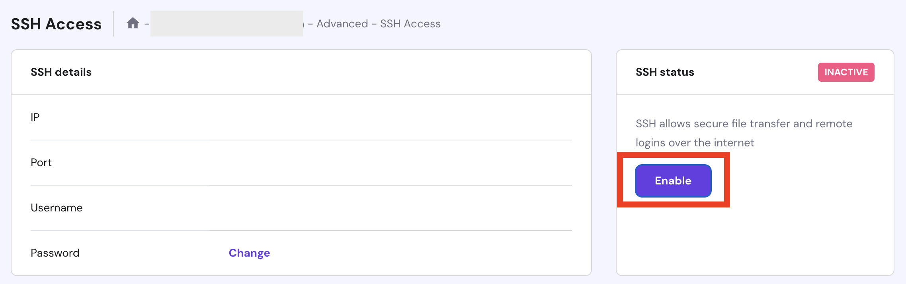
6. If you are **NOT** on **Windows** you can **skip** this step. If you are on **Windows** bruh... you are not cooking,
Follow this:
[Tutorial to setup SSH for windows terminal](https://youtu.be/3hbJZZ4c1io?si=QaRciN6AZXDJHc6a)
7. **Log in to SSH**, copy the **SSH** credentials into this section
 
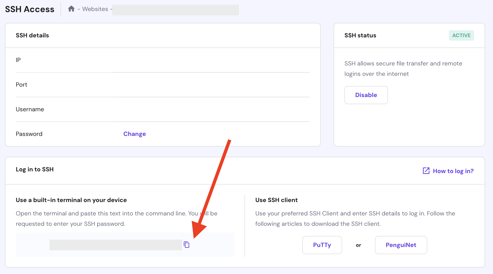
8. Open a **Terminal** and paste the **command** recently copied. You will be asked for Hostinger SSH Access  **password**. **Input** the **corresponding** password
You should now be connected to the Hostinger server terminal 
 

9. Navigate to `public_html`.
- `cd domains`
-  `cd yourdomain.com`
- `cd public_html`
10. Run: `git clone https://github.com/StarEngineer89/ci_tournament_bracket-generator` **Output**: 
 
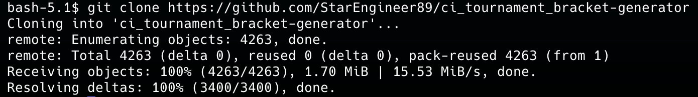
This means **Repository** is under **Hostinger's File Manager**.

## Step 2: First part project Setup

1. **Navigate** to the repo directory `cd ci_tournament_bracket-generator/`

2. **Run** `composer update`

3. **Rename** env to .env `mv env .env`

4. Verify it was **successfully**  renamed `ls -a` if you can see your `.env` file then it did.

## Step 3: Configure the Database

1. Go back to your **Hostinger Host Manager** 
2. In the left menu, click **Databases**
 
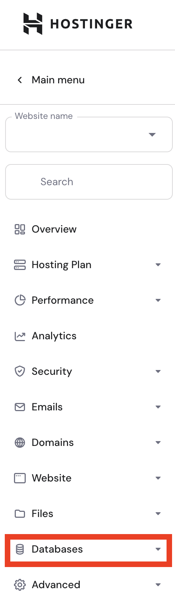
3. Click **Management**
 
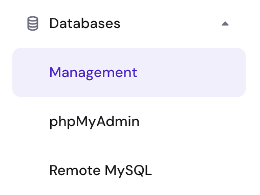
4. Create **database**
 
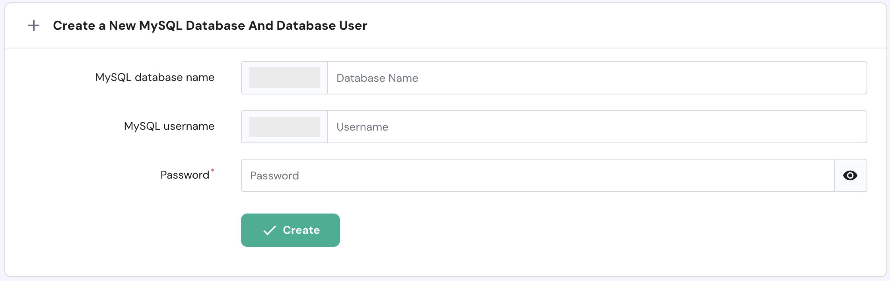
5. Click **Enter phpMyAdmin**
 
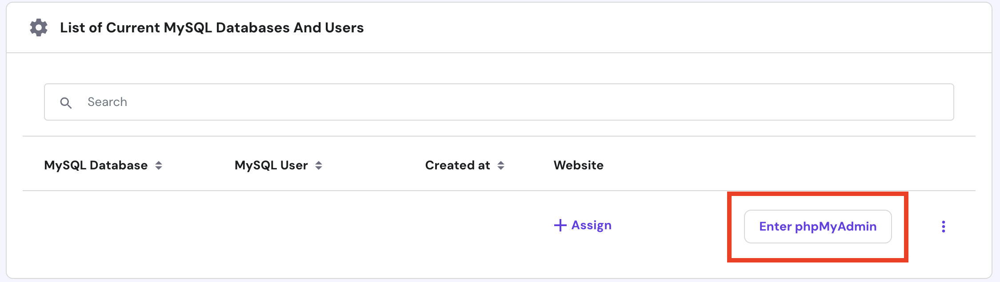
6. Click **Import**
 

7. Download [Tournaments Project Database](./database/sampleNameDB.sql)
8. Choose **.sql database** previously downloaded
 
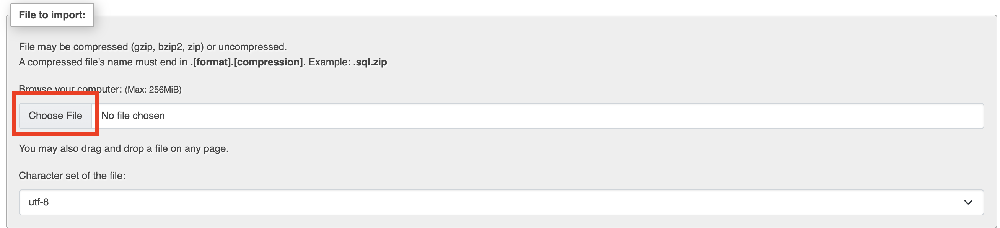
9. Leave everything as **default** and click **Import**
 
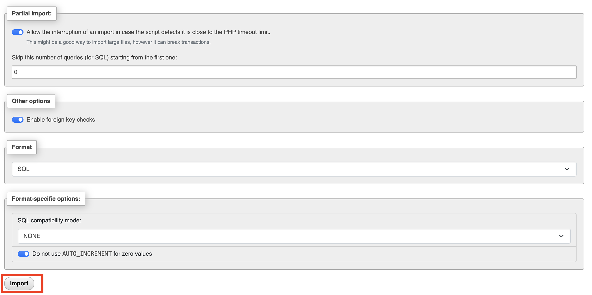
10. Go to **Overview** in **Hostinger** and click **File Manager** 
 
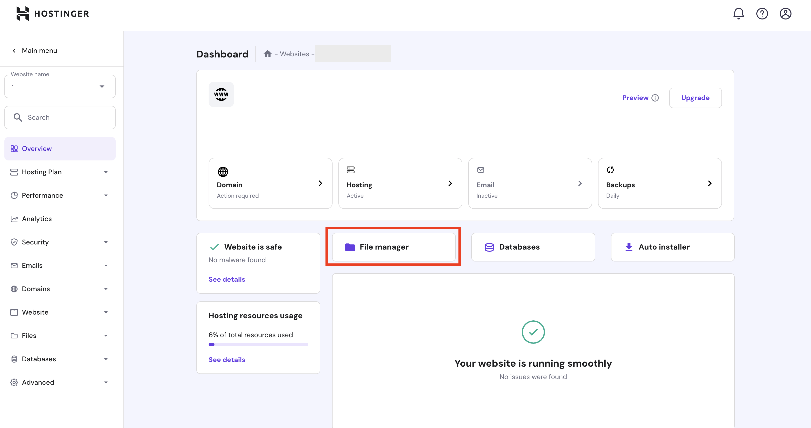
11. Open **public_html**
 
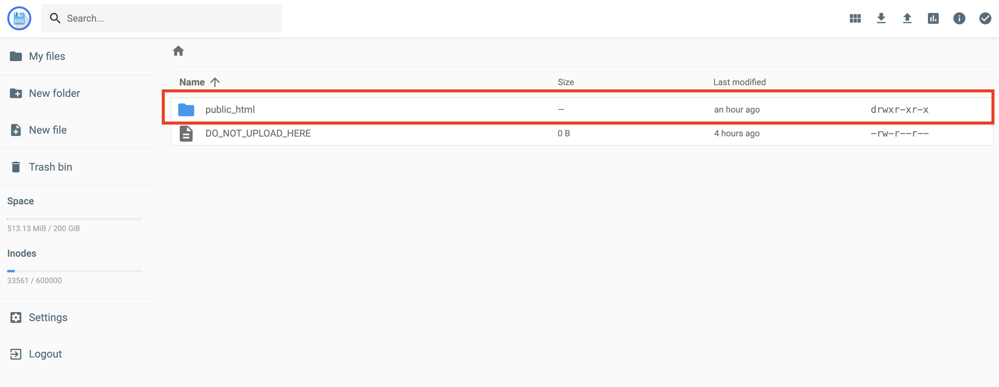
12. Open **ci_tournament_bracket-generator**
 
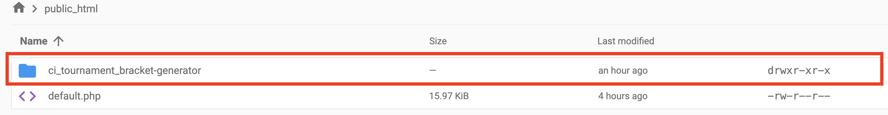
13. Open **.env**
 
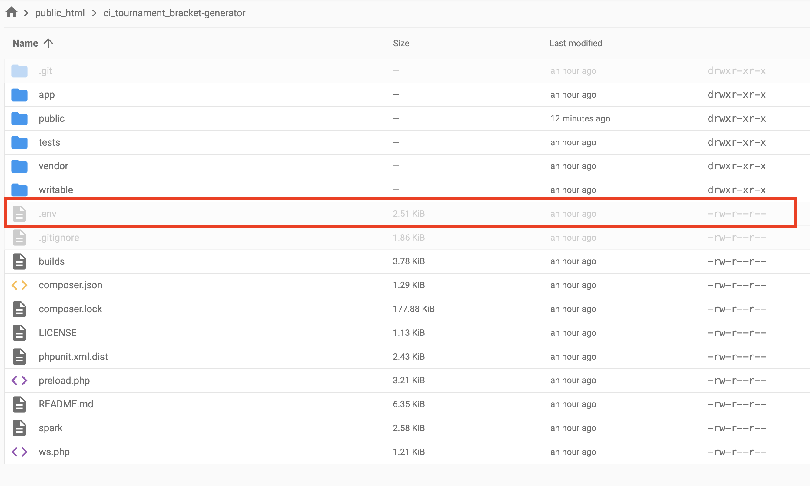
14. Uncomment `CI_ENVIRONMENT = production` and comment ` CI_ENVIRONMENT = development`
 
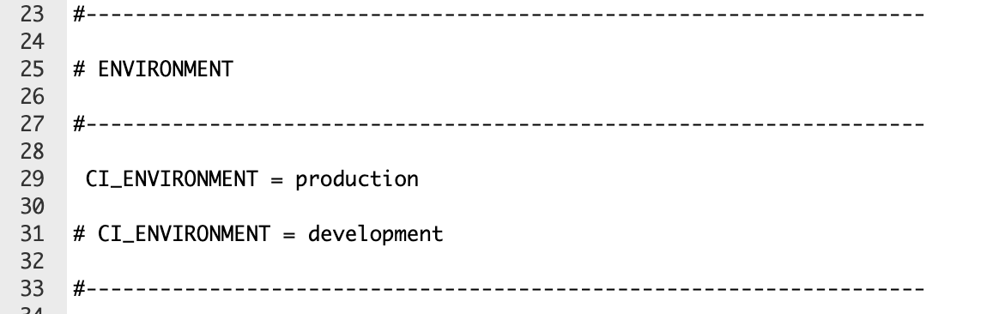
15. Type your app baseURL as a string: `'http://example.com/'`
 
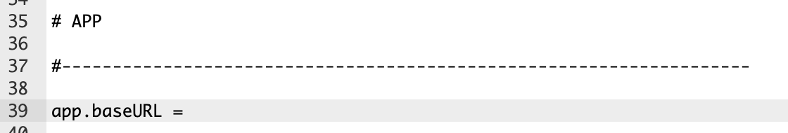
16. **Fill out** database information
- hostname: Hostinger's hostname is **localhost**
- database: **yourdatabasename**
- username: **yourusername**
- password: **yourpassword**
- **Leave** everything else as default
 
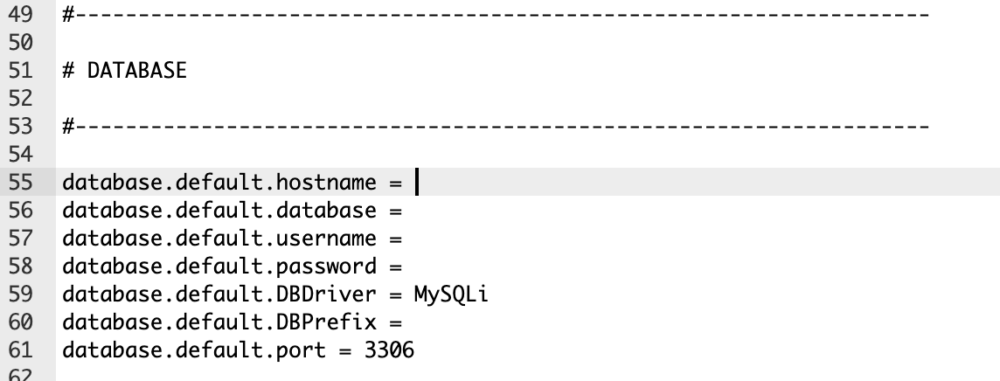
17. **Save** and **Close**
 

## Step 4: Second part project Setup

1. **Open** terminal again, remember we are connected to Hostinger Terminal SSH VIA. 
 

2. **Ensure** you are located **in** project **directory**
 
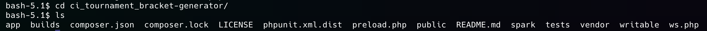

3. Run `pwd`
4. Copy the full path to your **directory**
5. Create **Symbolic Link**: `ln -s /path/to/your/directory/ci_tournament_bracket-generator/writable/uploads /path/to/your/directory/ci_tournament_bracket-generator/public/uploads`
6. Run `pwd` once again and save the whole `ci_tournament_bracket-generator` path
7. Run `exit` to quit **SSH** communication
8. Go back to Hostinger Overview, on the left menu click **Advanced**
 

9. Click **Cron Jobs**
 
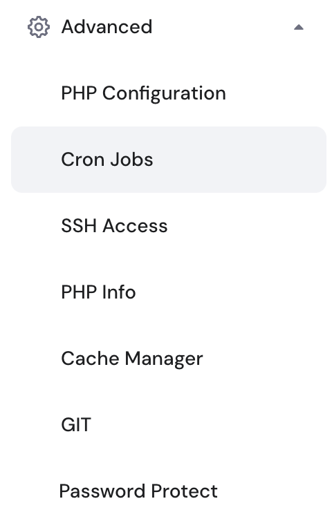
10. Click **Custom**
 
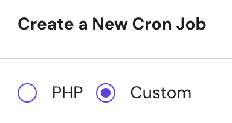
11. **Fill** out data
- Command to run: `/usr/bin/php /home/YOURuser/domains/YOURdomain/public_html/ci_tournament_bracket-generator/spark task:run`
 
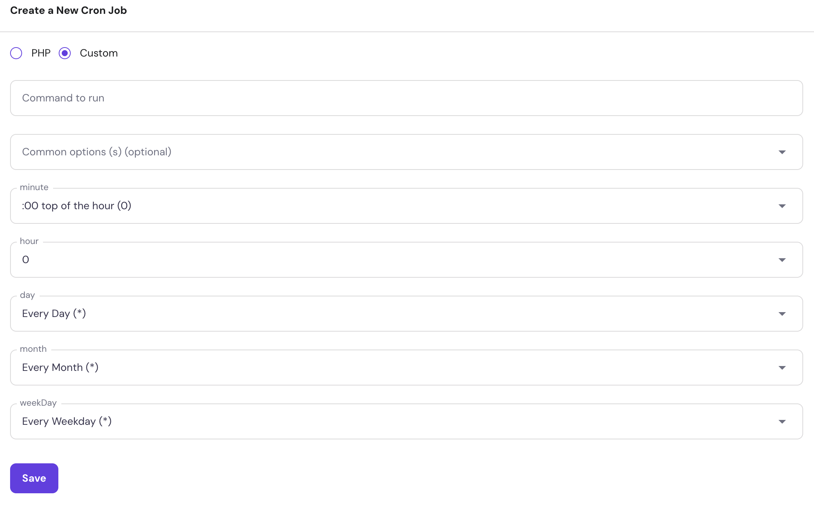
- Leave the rest as shown and click **Save**

## Conclusion

Your Tournaments project should now be set up and running on Hostinger. For further assistance, refer to Hostinger's [Knowledge Base](https://www.hostinger.com/tutorials/).
