# Tournaments Project Hosting Setup on Hostinger

## Prerequisites

Before you begin, ensure you have the following:
- A Hostinger account
- Domain configured
- SSH credentials
- Vim knowledge (If you don't know Vim, watch the following video: https://youtu.be/9cC9x-ntNQY?si=phVs66Fv8NdwzIdn)

## Step 1: Navigate to VPS Panel

1. Log in to your Hostinger account.
2. Navigate to the **VPS** section and click **Manage** 
<br>


3. Now you are under **Hostinger VPS panel!**
<br>


## Step 2: Create Database

1. Click **Manage Panel**
<br>

2. Now you are in Hestia's control Panel, in order to create a **new Database** you will need to create a **user**, click **Add User**
<br>


3. Now **fill out** form and click **save**
<br>


4. Navigate back to the **Users tab** and click on the **Login Icon**
<br>


5. Now, Navigate to the **DB tab**
<br>


6. Click **Add Database**
<br>


7. Now **fill out** form, remember your **Database's credentials** and click **save**
<br>


## Step 3: Connect to Hestia panel SSH via
SSH (Secure Shell) is a protocol used to securely connect to a remote computer or server over a network. It provides encrypted communication for tasks such as command-line access, file transfers, and remote administration.

1. If you are **NOT** on **Windows** you can **skip** this step. If you are on **Windows** bruh... you are not cooking,
Follow this:
[Tutorial to setup SSH for windows terminal](https://youtu.be/3hbJZZ4c1io?si=QaRciN6AZXDJHc6a)

2. Go back to your **Hostinger VPS panel**
3. Click **SSH access**
<br>


4. Copy the **SSH terminal credentials**
<br>


5. Open a **terminal** and paste **SSH credentials**
<br>


6. Input your **password**
<br>


## Step 4: Project setup

1. Install php: `sudo apt install php8.1 php8.1-cli php8.1-fpm php8.1-mbstring php8.1-xml php8.1-curl php8.1-zip -y` you can **verify** installation by running `php -v`

2. Download Composer installer `curl -sS https://getcomposer.org/installer -o composer-setup.php`

3. Run Composer installer `sudo php composer-setup.php --install-dir=/usr/local/bin --filename=composer`

4. Remove the installer `rm composer-setup.php` you can also **verify** installation by running `composer -v`

5. Navigate to your **public_html domain folder** `cd /home/youruser/web/yourdomain/public_html/`

6. Run: `git clone https://github.com/StarEngineer89/ci_tournament_bracket-generator` **Output**: 
<br>


7. Navigate to your project `cd project`

8. Run `composer update` you will be ask to `Continue as root/super user [yes]? ` type yes.
Output: 
<br>


9. Rename env to .env `mv env .env`

10. Open .env with vim `vim .env`

11. Edit your baseURL to `'https://yourdomain/'`
<br>


12. Edit your database credentials, use the credentials you created in **First Step**
<br>


13. Save and exit **vim** editor

13. Before running spark, we will need to setup kint. run `composer remove kint-php/kint && composer require kint-php/kint:^5.0 --dev`

13. Now, run `vim vendor/kint-php/kint/src/Renderer/RichRenderer.php`

13. Then change the following line: `public $richSort = Renderer::SORT_FULL;` to `public $richSort = RichRenderer::SORT_FULL;`

14. To migrate project database run `php spark shield:setup` you will be asked to overwrite type `n` when asked, then you will be ask to `Run spark migrate --all now?` type `y`
<br>

<br>


15. Now move **public folder to public_html** `mv public ..`

16. Navigate to **public_html** `cd ..`

17. Run `mv public/{.,}* .` this command moves recursively all public content to public's parent (public_html) then run la to verify everything moved as expected.
<br>


18. Delete public folder `rm -rf public`

19. Now, open index.php with vim `vim index.php` and edit FCPATH to `'./ci_tournament_bracket-generator/app/Config/Paths.php'`
<br>


20. Save and exit **vim** editor

-Now we will link writable/uploads to public_html/uploads

23. Navigate to uploads `cd ci_tournament_bracket-generator/writable/uploads`, run `pwd` and save that path.

24. Navigate to public_html `cd ../../..`

25. Now link upload directory `ln -s /path/to/your/codeigniter/writable/uploads /path/to/your/public_html/`

-Now we need to give some permissions to writable folder. 

21. Navigate to writable `cd /project/writable`

22. Give permissions to the whole writable folder `sudo chmod -R 0777 .`

-We will now need to update the uploads structure a little.

26. Navigate to uploads `cd uploads`

27. Run the following command:
```
mkdir audios
mkdir audios/local
mkdir audios/url
mkdir videos
mkdir videos/local
mkdir videos/url
mkdir images
mkdir images/participants
mkdir CSV
mkdir CSV/UserLocal
```

-Finally, the only missing thing is setting up cronjob

26. Type `crontab -e` you will open a crontab config file with vim.

27. Copy and paste the following cronjob ```* * * * * /usr/bin/php /home/admin/web/tourneyforge.com/public_html/ci_tournament_bracket-generator/spark task:run >> /home/admin/web/tourneyforge.com/public_html/ci_tournament_bracket-generator/cronjob.log 2>&1```

28. Make sure to save and exit, the script above.

### What It Does

-This cron job runs a PHP script to generate and update tournament brackets automatically, making sure everything stays up to date without manual input.

### How Often It Runs

-It runs every minute, so updates happen in real-time.

### How It Works
	•	Executes the PHP script at:
/home/admin/web/tourneyforge.com/public_html/ci_tournament_bracket-generator/spark task:run
	•	Logs all output and errors to:
/home/admin/web/tourneyforge.com/public_html/ci_tournament_bracket-generator/cronjob.log

### Why the Logging?

All output and errors get saved in cronjob.log, making it easy to track what’s happening and troubleshoot if needed.

### Command explanation: 

	•	* * * * * → Runs every minute
	•	/usr/bin/php → Runs the script using PHP
	•	spark task:run → Calls a task in CodeIgniter
	•	>> cronjob.log 2>&1 → Saves both output and errors to the log file

<!--26. Navigate to your project `cd project/`

27. Run `pwd` and save project's full path

26. Go back to **Hestia control panel** and click **CRON**
<br>


27. Click **Add Cron Job**
<br>


28. Under comman section write down the following command: /usr/bin/php /path/to/your/project/spark task:run
<br>
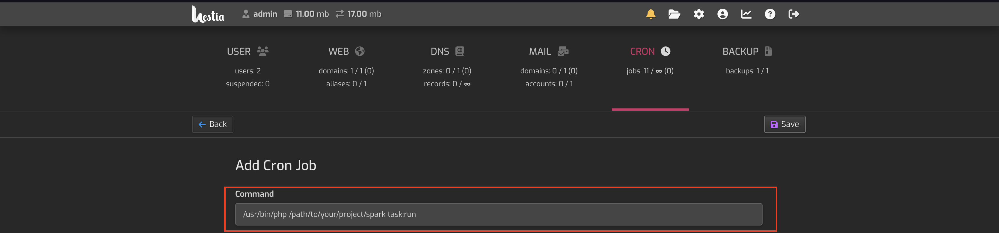

29. By default, it is set to every minute, which is what we need. You can just click **generate**
<br>


30. Click **save**
<br>

-->
## Step 5: WebSocket setup
    
 #### Context: 
 Locally, setting up the WebSocket is straightforward; it simply involves running the WebSocket server, and the brackets pop-up feature (which relies on WebSocket) renders the information seamlessly. However, in a production environment where we are deploying to a remote server, the domain must use HTTPS instead of HTTP to provide users with a secure and reliable experience. Since the brackets pop-up feature depends on WebSocket communication and the domain uses HTTPS, the WebSocket connection must also be secure (`wss` instead of `ws`) to establish bidirectional communication.

To enable this, we need to configure SSL for the server.
 
 You will need to setup SSL certificates, by default **HestiaCP** provides a *Let's Encrypt to obtain SSL certificate* option, this SSL certificate is already **Authenticated** this will help us to make our domain secure.

 1. Go back to **HestiaCP** and under *WEB* click **edit** domain
<br>


2. Enable all 4 options shown below.
<br>


3. Click "Save"
<br>
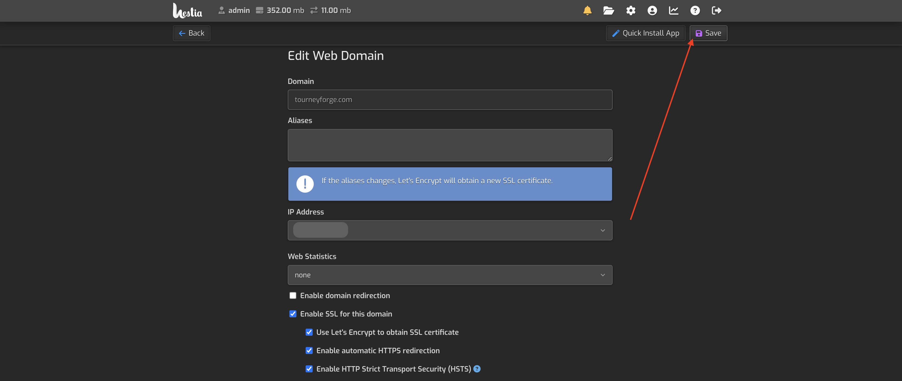

1. Now **Go back** to SSH Terminal and you will need to copy the path of your SSL certificates (They are set by default). You can find them under: `/usr/local/hestia/data/users/admin/ssl/domainname.com.crt` and `/usr/local/hestia/data/users/admin/ssl/domainname.com.key`

2. Navigate under the project directory and run `vim ws.php`

3. Edit the ws.php as shown below. Don't forget to change the certificates paths

```
<?php

use Ratchet\MessageComponentInterface;
use Ratchet\ConnectionInterface;
use Ratchet\Server\IoServer;
use Ratchet\Http\HttpServer;
use Ratchet\WebSocket\WsServer;
use React\Socket\Server as ReactServer;
use React\Socket\SecureServer;

require __DIR__ . '/vendor/autoload.php';

class WebSocketsServer implements MessageComponentInterface {
    protected $clients;
    public function __construct() {
        $this->clients = new \SplObjectStorage;
    }
    public function onOpen(ConnectionInterface $conn) {
        $this->clients->attach($conn);
        echo "New connection! ({$conn->resourceId})\n";
    }
    public function onMessage(ConnectionInterface $from, $msg) {
        foreach ($this->clients as $client) {
            if ($from !== $client) {
                $client->send($msg);
            }
        }
    }
    public function onClose(ConnectionInterface $conn) {
        $this->clients->detach($conn);
        echo "Connection {$conn->resourceId} has disconnected\n";
    }
    public function onError(ConnectionInterface $conn, \Exception $e) {
        echo "An error has occurred: {$e->getMessage()}\n";
        $conn->close();
    }
}

$cert = '/usr/local/hestia/data/users/admin/ssl/tourneyforge.com.crt';
$key = '/usr/local/hestia/data/users/admin/ssl/tourneyforge.com.key';

$loop = React\EventLoop\Factory::create();
$socket = new ReactServer('0.0.0.0:8092', $loop);

$secureSocket = new SecureServer($socket, $loop, [
    'local_cert' => $cert,
    'local_pk' => $key,
    'allow_self_signed' => true,  //Set to false in production
    'verify_peer' => false,       //Set to true in production
]);

$wsServer = new HttpServer(
    new WsServer(
        new WebSocketsServer()
    )
);

$server = new Ratchet\Server\IoServer($wsServer, $secureSocket, $loop);
echo "Secure WebSocket server running on wss://localhost:8092\n";
$address = $secureSocket->getAddress();
echo "$address";
$server->run();
```

4. The script above, runs a websocket under the 8092 port by default the hosting already has some ports that receive TCP Requests, however, if we want to add custom ports we will need to configure the firewall with the following command. First we will need to go to our **iptables file** which is under the **etc** directory just run the following command: `cd /etc` then open the `iptables.rules` by running `vim iptables.rules`
You will find a file like this: 
```# Generated by iptables-save v1.8.7 on Mon Nov  4 06:45:34 2024
*filter
:INPUT DROP [0:0]
:FORWARD ACCEPT [0:0]
:OUTPUT ACCEPT [0:0]
:fail2ban-HESTIA - [0:0]
:fail2ban-MAIL - [0:0]
:fail2ban-RECIDIVE - [0:0]
:fail2ban-SSH - [0:0]
:fail2ban-WEB - [0:0]
:hestia - [0:0]
-A INPUT -p tcp -m multiport --dports 80,443 -j fail2ban-WEB
-A INPUT -p tcp -m tcp --dport 8083 -j fail2ban-HESTIA
-A INPUT -p tcp -m multiport --dports 25,465,587,110,995,143,993 -j fail2ban-MAIL
-A INPUT -p tcp -m tcp --dport 22 -j fail2ban-SSH
-A INPUT -p tcp -m multiport --dports 1:65535 -j fail2ban-RECIDIVE
-A INPUT -m state --state RELATED,ESTABLISHED -j ACCEPT
-A INPUT -s 145.223.73.244/32 -j ACCEPT
-A INPUT -s 127.0.0.1/32 -j ACCEPT
-A INPUT -p tcp -m tcp --dport 22 -j ACCEPT
-A INPUT -p tcp -m multiport --dports 80,443 -j ACCEPT
-A INPUT -p tcp -m multiport --dports 21,12000:12100 -j ACCEPT
-A INPUT -p udp -m udp --dport 53 -j ACCEPT
-A INPUT -p tcp -m tcp --dport 53 -j ACCEPT
-A INPUT -p tcp -m multiport --dports 25,465,587 -j ACCEPT
-A INPUT -p tcp -m multiport --dports 110,995 -j ACCEPT
-A INPUT -p tcp -m multiport --dports 143,993 -j ACCEPT
-A INPUT -p tcp -m tcp --dport 8083 -j ACCEPT
-A INPUT -p tcp -m tcp --dport 8092 -j ACCEPT
-A INPUT -p icmp -j ACCEPT
-A fail2ban-HESTIA -j RETURN
-A fail2ban-MAIL -j RETURN
-A fail2ban-RECIDIVE -j RETURN
-A fail2ban-SSH -j RETURN
-A fail2ban-WEB -j RETURN
COMMIT
# Completed on Mon Nov  4 06:45:34 2024
```

5. Now you will add at the end of the tcp rules the following rule: `-A INPUT -p tcp -m tcp --dport 8092 -j ACCEPT`, exit and save the file.

6. You will need to restart the firewall configuration by running the following command `sudo iptables-restore < /etc/iptables.rules`

7. Now you will need to run the ws.php using **tmux**, in order to do that, we will need to install tmux, run `apt install tmux`.

8. Now initialize **tmux** run: `tmux`, now this will create a new instance of a virtual terminal.

9. Make sure you are under the correct directory (wherever ws.php is located). Run:  `php ws.php run`

10. Now we have to detach our terminal to the virtual instance (the websocket will continue running). In order to do that you will need to press: `Ctrl-b + d`

## The steps above are meant for running the websocket manually, but whenever the server gets rebooted you will need to manually run it again. Follow the next section to make websocket automatically run on reboot.

## Step 6: WebSocket automatization (run on reboot)

### In this section we will use resources like `systemd` in order to make the Operating System to always run some scripts to make websocket run.
#### It is important to mention what the main script does: It kills ALL processes running on port 8092, usually there shouulnd't be any, but once a port is opened and allowed in our firewall, the Operating System will always try to occupy it. After it kills all processes, it runs the websocket (which we configured before) and sets up the responsible user as root.

1. **Iptables setup:** If the iptables.rules file is not yet set up or you are unsure, refer to Steps 4, 5, and 6 from the previous section to complete its configuration.
#### Note: **You do not need to set up the iptables.rules file again if you completed  Step 6 of the previous section.**

2. Now, we will need to create a *.service* file under the **system** direcrotry, in order to do that run: `cd /etc/systemd/system && vim ws-server.service` this command will navigate to the **system** directory and create (or overwrite) a file named **ws-server.service**. 

3. Copy and paste the following code:

```
[Unit]
Description=WebSocket Server for TourneyForge
After=network.target

[Service]
Type=simple
ExecStartPre=/bin/bash -c 'fuser -k 8092/tcp || true'
ExecStart=php /home/admin/web/tourneyforge.com/public_html/ci_tournament_bracket-generator/ws.php run
Restart=always
User=root
WorkingDirectory=/home/admin/web/tourneyforge.com/public_html/ci_tournament_bracket-generator

[Install]
WantedBy=multi-user.target
```

4. Now, since the source configuration file or drop-ins of **ws-server.service** changed on disk, we will need to reload units by runnning the following command: `systemctl daemon-reload`.

5. Then, we will need to restart the service we just created so we will run `systemctl restart ws-server`.

6. Now you are done, the websocket will always be running even if you reboot, it should be a good practice to reboot now just to verify if everything is working as expected. Run `reboot` (it can take up to 10 minutes).

## Step 7: Ffmpeg and yt-dlp to reproduce URL multimedia 

### In this section we install Ffmpeg and yt-dlp and youtube web cookies in order to reproduce URL multimedia

1. Update packages list (as a good practice) `sudo apt update` 

2. Install Ffmpeg `sudo apt install ffmpeg`
<br>
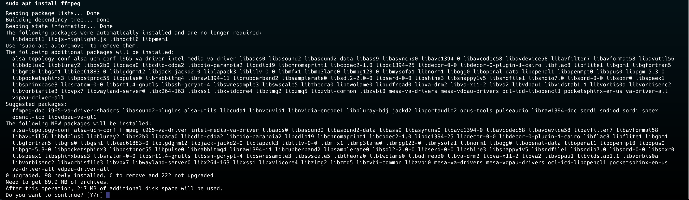

3. Type `Y` and then wait, you will have ffmpeg downloaded.

4. Check if it was correctly installed `ffmpeg -version`, Output:
<br>
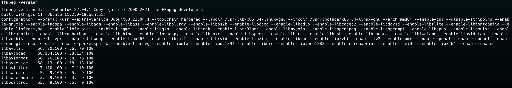

2. Install yt-dlp `sudo apt install yt-dlp`
<br>
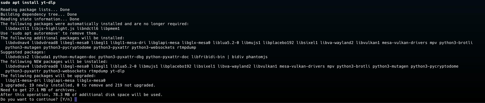

3. Type `Y` and then wait, you will have yt-dlp downloaded.

4. Check if it was correctly installed `yt-dlp --version`, Output:
<br>
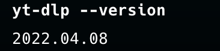

### Cookies section:
#### In this section you will learn how to copy cookies from any website (Using Chrome)

5. First, open Google Chrome.
<br>


6. Now, copy and paste into the box shown in the image, the following URL: *https://chromewebstore.google.com/detail/editthiscookie/jpdpholcdjghlginfdaphhefdonkmohg*
<br>
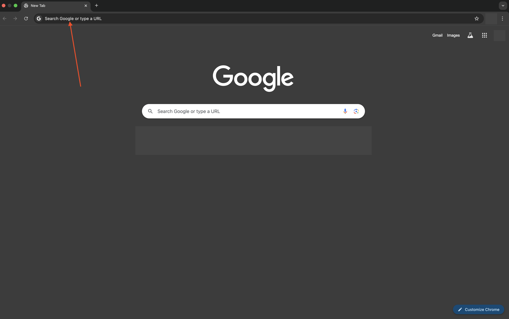

7. After being redirected into Chrome web store, click on "Add to Chrome"
<br>
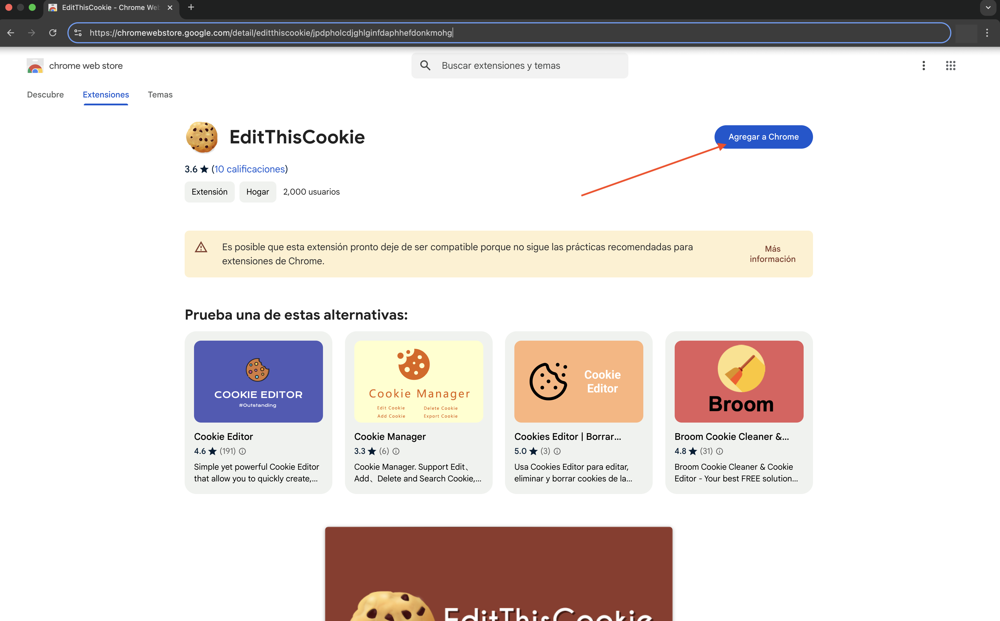

8. Click on the icon at the top right of the window:
<br>
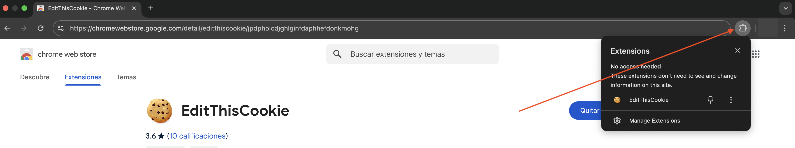

9. Click the pin icon (which will have the Cookies extension pinned at the top right of our browser)
<br>
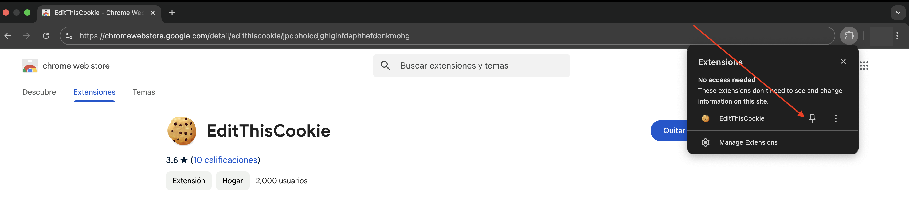

-Now we will need to export the cookies in a certain format that will allow our code to use them

10. Click on the Cookie icon.
<br>


11. Click on the Options icon.
<br>
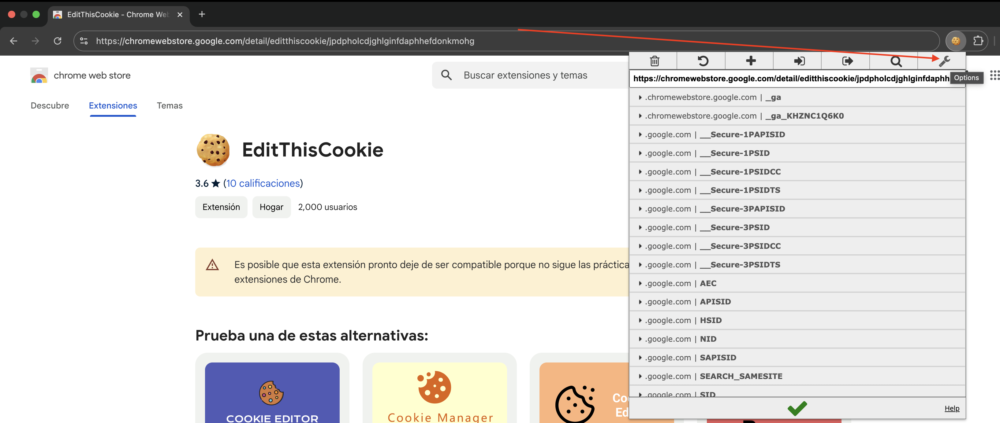

12. You will be redirected to the extension's support page. Click **options**
<br>
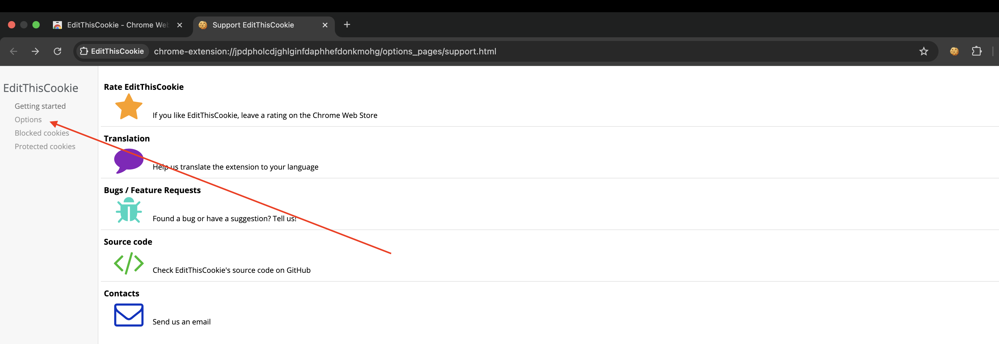

13. Now, you will  choose a different export format (it's json by default). Click on the box shown below
<br>


14. Now click on the format shown in the **following image**  (Netscape HTTP Cookie file)
<br>
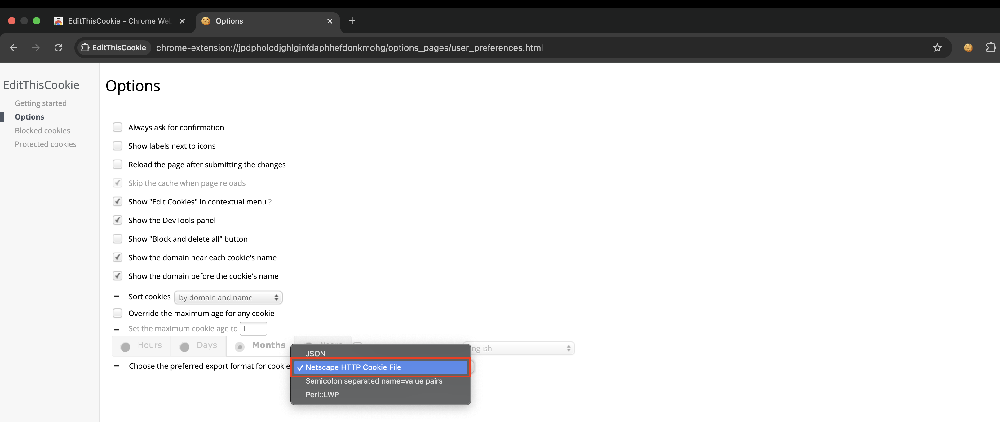

15. You can now ope a new tab and go to the following link, by clicking on it or copy and paste it into your browser *https://www.youtube.com/?app=desktop&hl=en*
<br>


16. Once on Youtube, click the **cookie icon** at the **top right** of the screen
<br>
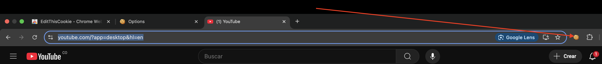

17. Then, click on Export. You will get the following message - *Cookies copied to clipboard*
<br>
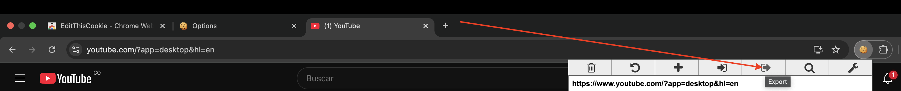

18. Save the Cookies wherever you want as **www.youtube.com_cookiestxt**.

19. Save that path for later use.
### End of Cookies section

20. Go back to your ssh terminal, we will be editing two files into the project, the first one is UploadConfig.php which is under: ci_tournamet_bracket-generator/app/Config/UploadConfig.php

21. Navigate to `cd yourProjectpath/app/Config/`

22. Type this command `which ffmpeg && which yt-dlp`, that will output both ffmpeg and yt-dlp paths. That will help us for next steps. **Note: both paths should normally be the same**

23. Open UploadConfig.php `vim UploadConfig.php`, make sure to edit the ffmpegPath and cookiesPath, to yours.

```
<?php

namespace Config;

use CodeIgniter\Config\BaseConfig;

class UploadConfig extends BaseConfig
{
    public $localAudioUploadPath = 'audios/local/';
    public $urlAudioUploadPath = 'audios/url/';
    public $localVideoUploadPath = 'videos/local/';
    public $urlVideoUploadPath = 'videos/url/';
    public $descriptionImagesUploadPath = 'images/description/';
    public $participantImagesUploadPath = 'images/participants/';
    public $csvUploadPath = 'CSV/UserLocal/';
    public $ffmpegPath = '/usr/local/bin/';
}
```

- Development was meant for a windows server, which means some of the paths written into the code shouldn't be the same as a ubuntu server. that is why we will modify the **process** function under TournamentController.php. (ci_tournamet_bracket-generator/app/Controllers/Api/TournamentController.php.php)

24. Type: `cd ..`

25. Navigate to the path: `cd Controllers/Api/`

26. Open the file we want to edit: `vim TournamentController.php`

27. Look for the **process** function and modify it with the following updated version of it: 

```
   public function process($youtubeLink, $type = 'audio')
    {
        $uploadConfig = new UploadConfig();

        parse_str( parse_url( $youtubeLink, PHP_URL_QUERY ), $vars );

        if (isset($vars['v'])) {
            $video_id = $vars['v'];
        }

        if (isset($vars['si'])) {
            $video_id = $vars['si'];
        }

        $yt = new YoutubeDl();
        $yt->setBinPath($uploadConfig->ffmpegPath . 'yt-dlp');
        if ($type == 'audio') {
            if (file_exists(WRITEPATH . "uploads/$uploadConfig->urlAudioUploadPath/" . $video_id . '.mp3')) {
                return $video_id . '.mp3';
            }

            $collection = $yt->download(
                Options::create()
                    ->downloadPath(WRITEPATH . "uploads/$uploadConfig->urlAudioUploadPath")
                    ->extractAudio(true)
                    ->audioFormat('mp3')
                    ->audioQuality('0') // best
                    ->output($video_id)
                    ->url($youtubeLink)
                    ->cookies($uploadConfig->ffmpegPath . 'cookies.txt')
            );

            $filetype = '.mp3';
        } else {
            if (file_exists(WRITEPATH . "uploads/$uploadConfig->urlVideoUploadPath/" . $video_id . '.mp4')) {
                return $video_id . '.mp4';
            }

            $collection = $yt->download(
                Options::create()
                    ->downloadPath(WRITEPATH . "uploads/$uploadConfig->urlVideoUploadPath")
                    ->format('mp4')
                    ->output($video_id . '.mp4')
                    ->url($youtubeLink)
                    ->cookies($uploadConfig->ffmpegPath . 'cookies.txt')
            );

            $filetype = '.mp4';
        }

        foreach ($collection->getVideos() as $video) {
            if ($video->getError() !== null) {
                echo "Error downloading video: {$video->getError()}.";
                log_message('debug', $video->getError());
            }
        }

        return $video_id . $filetype;
    }
```

#### Change notes:

- We replaced ```$yt->setBinPath($uploadConfig->ffmpegPath . 'bin\yt-dlp.exe');``` to ```$yt->setBinPath($uploadConfig->ffmpegPath . 'yt-dlp');``` That's because we needed to set that command for a Ubuntu OS so there is no .exe file for yt-dlp. Also made a little change to the path command (since we also changed the paths a few steps before)

- We changed ```->cookies($uploadConfig->ffmpegPath . 'www.youtube.com_cookies.txt')``` to ```->cookies($uploadConfig->ffmpegPath . 'cookies.txt')``` I just wanted name to be shorter lol

**Changes weren't as significant but since you are using vim and changing a specific function is just easier for you to replace the whole function by copying and pasting.**

## Congrats! you have successfully set up the project.